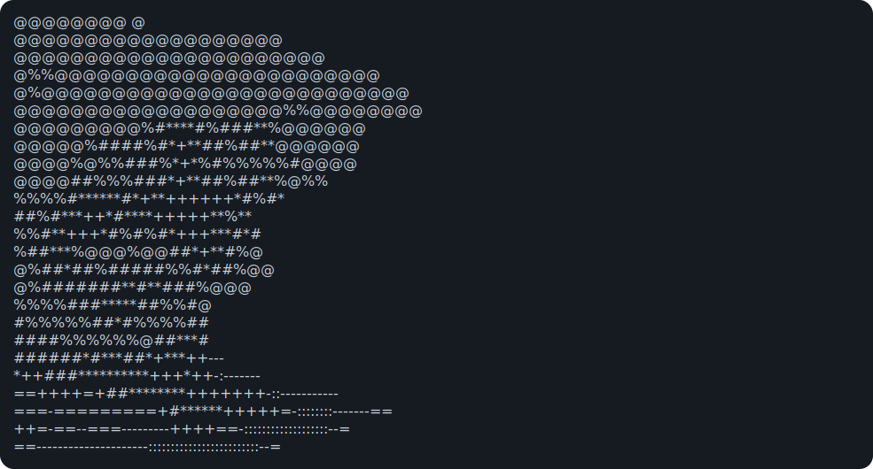

### ¡Hola! 👋  
#### Estudiante de Ingeniería Informática | Entusiasta del UI/UX | Futuro Desarrollador Frontend  

📚 Estudiando Ingeniería Informática en la [Universidad Europea del Atlántico](https://uneatlantico.es)  
🎨 Apasionado por el **diseño digital** 
⚡ Enfocado en el futuro en el **desarrollo con React** y **tecnologías frontend**  

- Actualmente aprendiendo: `JavaScript`, `CSS`, `HTML`, `Figma`, `React`  

